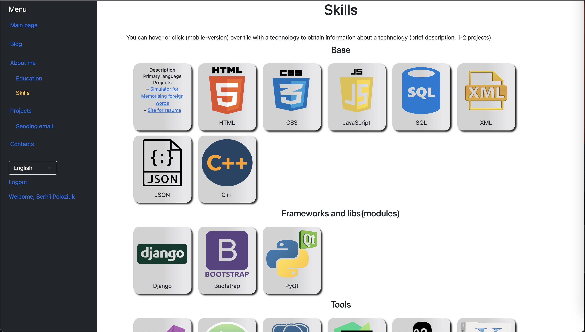
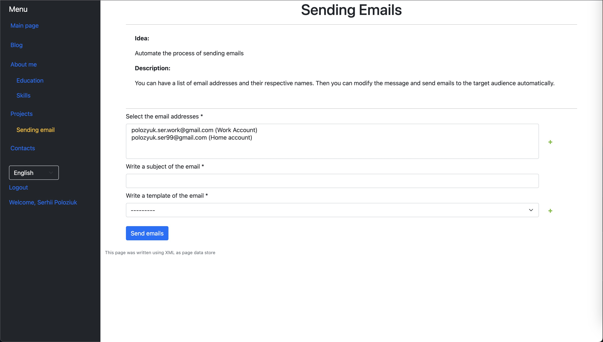

<h1 align="center">Hi there, I'm SERHII 
</h1>
<h3 align="center">Python Developer from Ukraine</h3>


## Table of contents
* [General info](#general-info)
* [Project Status](#project-Status)
* [Technologies](#technologies)
* [Setup](#setup)
* [Screenshots](#screenshots)


## Link to website
<a href="https://github.com/ritaly/README-cheatsheet"> Website</a>

## General info

* I made this project for CV/Resume. The project is a website "About Me". 
* The website provides information about me (education, skills, contacts) and my little projects to study Django.
	
## Technologies
Project is created with:
* Python==3.11.0
* Django==4.1.7
* django-crispy-forms==2.0
* django-modeltranslation==0.18.8
* django-bootstrap-v5==1.0.11
* django-parler==2.3
* django-rosetta==0.9.8
* django.core.mail
* Pillow==9.5.0
* Bootstrap==5.3.0
* PostgreSQL==14.6.0
* XML
* JSON
* Javascript
* CSS
* HTML

<details><summary>Other Technologies (CLICK ME)</summary>
<ul>
<li>asgiref==3.6.0</li>
<li>boto3==1.26.164</li>
<li>botocore==1.29.164</li>
<li>cachetools==5.3.0</li>
<li>certifi==2022.12.7</li>
<li>chardet==5.1.0</li>
<li>charset-normalizer==3.0.1</li>
<li>colorama==0.4.6</li>
<li>crispy-bootstrap5==0.7</li>
<li>distlib==0.3.6</li>
<li>django-bootstrap-icons==0.8.2</li>
<li>django-rotate-secret-key==0.3</li>
<li>django-ses==3.5.0</li>
<li>filelock==3.9.0</li>
<li>idna==3.4</li>
<li>jmespath==1.0.1</li>
<li>packaging==23.0</li>
<li>platformdirs==2.6.2</li>
<li>pluggy==1.0.0</li>
<li>polib==1.1.1</li>
<li>psycopg2-binary==2.9.5</li>
<li>pyproject_api==1.5.0</li>
<li>python-dateutil==2.8.2</li>
<li>pytz==2023.3</li>
<li>requests==2.28.2</li>
<li>s3transfer==0.6.1</li>
<li>six==1.16.0</li>
<li>soupsieve==2.3.2</li>
<li>sqlparse==0.4.3</li>
<li>tox==4.4.4</li>
<li>typing_extensions==4.4.0</li>
<li>urllib3==1.26.14</li>
<li>virtualenv==20.18.0</li>
</ul>
</details>

## Setup
1. install PostgreSQL
2. To run this project, it installs locally using terminal:
   1.  If you are using Unix/Linux/macOS
    ```
    $ python3 -m pip install --user virtualenv
    $ python3 -m venv env
    $ source env/bin/activate
    $ clone git https://github.com/Oskorbin-work/About_me.git
    $ cd About_me
    $ pip install -r requirements.txt
    $ python manage.py makemigrations 
    $ python manage.py migrate
    $ python manage.py collectstatic
    $ python3 manage.py runserver
    ```
    2.  If you are Windows
    ```
    $ py -m pip install --user virtualenv
    $ py -m venv env
    $ .\env\Scripts\activate
    $ clone git https://github.com/Oskorbin-work/About_me.git
    $ cd About_me
    $ pip install -r requirements.txt
    $ python manage.py makemigrations 
    $ python manage.py migrate
    $ python manage.py collectstatic
    $ python3 manage.py runserver
    ```
# Screenshots
page "main_page/"
<br>

page "blog/post_list/"
<br>

page "about_me/education/"
<br>

page "about_me/education/grades/<int:pk>/"
<br>

page "about_me/skills/"
<br>

page "about_me/projects/sending_emails/"
<br>

page "about_me/contacts/"
<br>

page "about_me/profile/<username>/"
<br>

## Project Status
<i>Complete</i>

